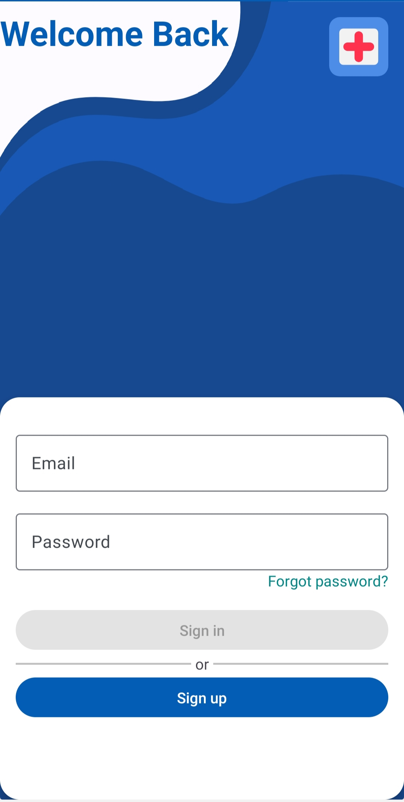
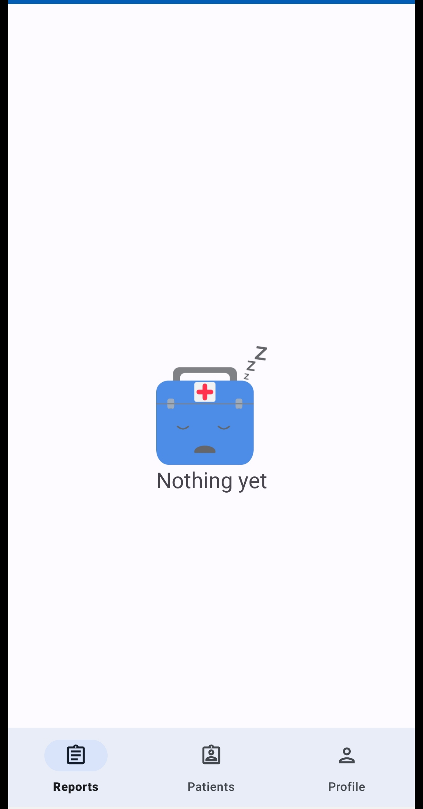

# 🏥 HealthCore

**HealthCore** is a robust Android application designed to simple health record management. It allows users to store, track, and review health data securely, all from their mobile device.

---
## 🖼 Screenshots

Here are some screenshots showcasing key features of the app:
<p align="center" style="display: flex; flex-wrap: wrap; justify-content: center; gap: 15px;">
  
  
  
  
  
  
  
  
  
  <style>
  .phone-img {
    width: 150px;
    height: 300px;
    object-fit: cover;
    border-radius: 30px;
    overflow: hidden;
    box-shadow: 0 4px 10px rgba(0,0,0,0.2);
  }
</style>
</p>


---


## 📽 Demo Video

Watch HealthCore in action:

https://github.com/user-attachments/assets/3faeb034-14fc-47bb-8ea0-f4c4b4fa51db

---

## 🚀 Features

- 🧍 See nearby patients on a map  
- 📊 Ability to add report to a medical staff
- 📅 Medical staff can manage patient health from app and update their state 
---

## 📱 Getting Started

### Requirements

- Android 6.0 (API 23) and above  
- Android Studio (latest stable recommended)

### How to Build

1. Clone this repository:
   ```bash
   git clone https://github.com/Issasafar/HealthCore.git
   cd HealthCore
